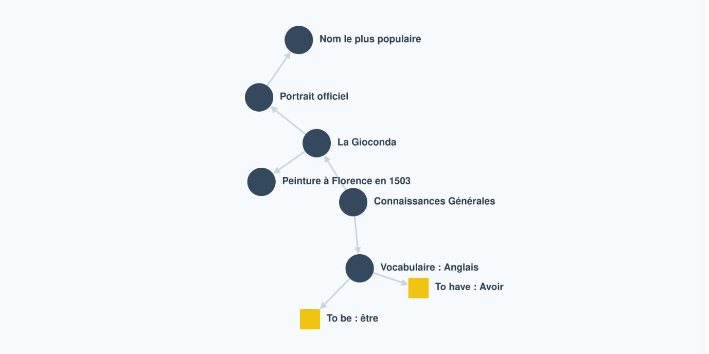
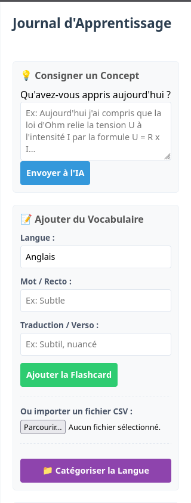
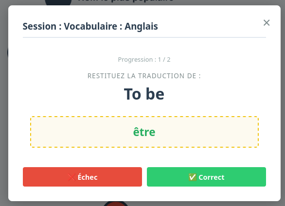
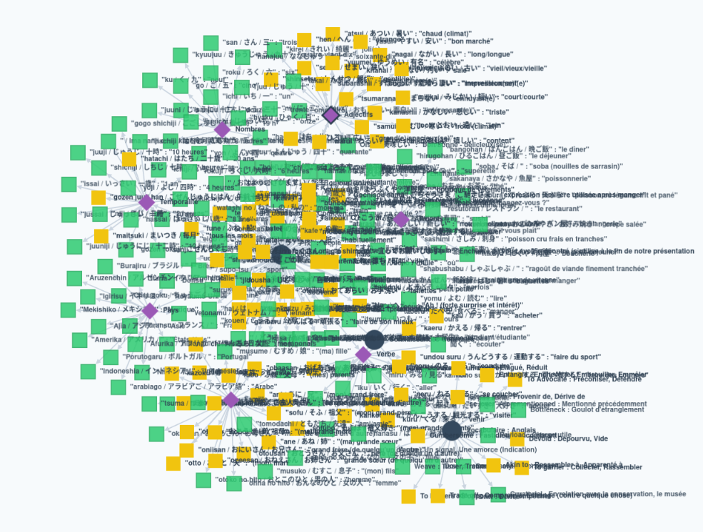
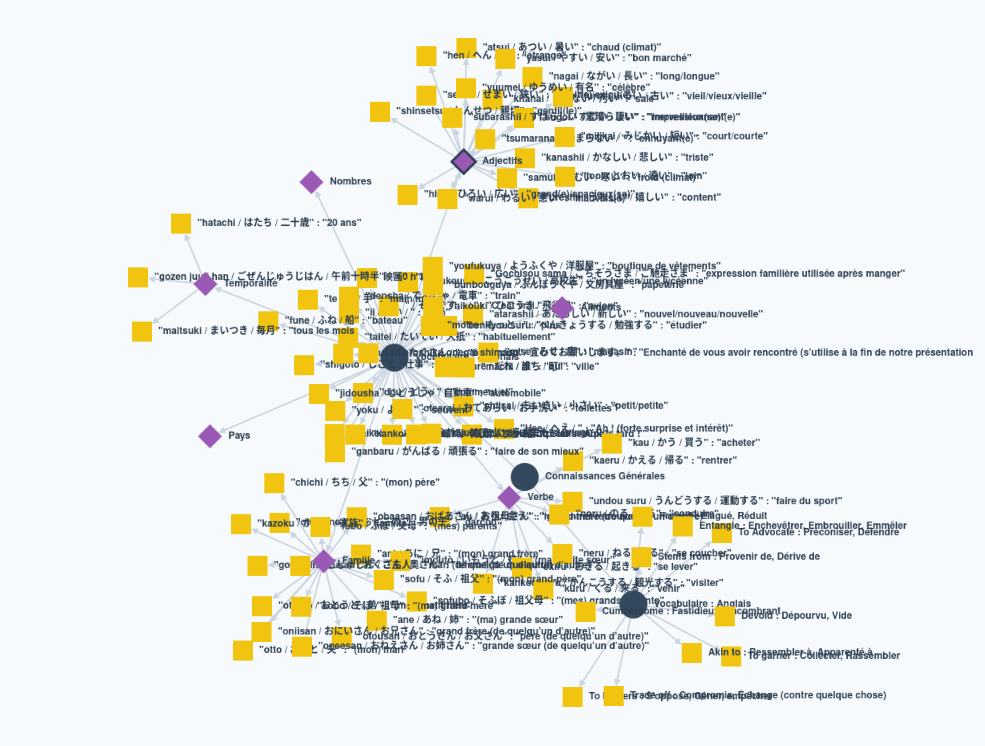
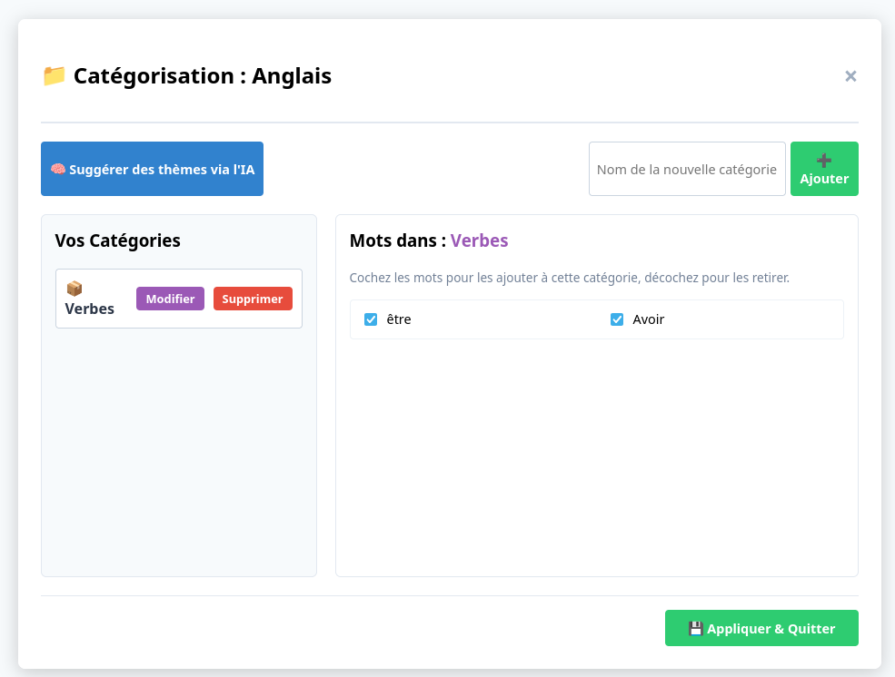

# KnowlegdeGraph - MindMap d'Apprentissage Linguistique

LearnGraph est une application web interactive permettant de structurer ses connaissances et son vocabulaire sous forme de carte mentale (MindMap) dynamique. L'application intègre un système d'auto-évaluation par flashcards ainsi qu'une assistance par Intelligence Artificielle pour organiser automatiquement les termes par catégories.

---

## 🛠 Architecture & Technologies

L'application repose sur une architecture client-serveur légère, asynchrone et non bloquante :

* **Interface (Frontend) :** HTML5, CSS3 (variables dynamiques pour les modes de vue) et JavaScript natif.
* **Moteur Graphique :** Cytoscape.js pour le rendu, la manipulation et la réorganisation spatiale des nœuds.
* **Serveur (Backend) :** Node.js avec Express, configuré pour accepter des payloads volumineux (jusqu'à 50 Mo) lors de l'importation de dictionnaires massifs.
* **Persistance :** Sauvegarde automatisée "en dur" dans un fichier local structuré (`mindmap.json`).

---

## 🚀 Fonctionnalités Principales

### 1. Gestion et Visualisation du Graphe

L'écran principal affiche l'arbre de connaissances. Chaque type de nœud possède une sémantique visuelle propre :

* **Nœud Concept / Langue (Bleu) :** Représente la racine d'une langue ou d'un grand domaine de connaissances.
* **Nœud Catégorie (Violet / Losange) :** Regroupement thématique intermédiaire.
* **Nœud Vocabulaire (Jaune / Vert / Rouge) :** Flashcards individuelles dont la couleur varie selon l'état de mémorisation.



### 2. Ajout de Vocabulaire (Direct & Massif)

L'utilisateur peut enrichir sa base de connaissances de deux manières :

* **Saisie directe :** Un formulaire permet d'entrer manuellement un terme, sa définition et sa langue cible.
* **Import CSV :** Importation instantanée via un fichier texte (format `Terme;Définition`) traité localement par le navigateur pour éviter le gel de l'interface.



### 3. Système de Quiz et d'Auto-Évaluation

Le système de révision s'adapte au ciblage de l'utilisateur sur le graphe :

* **Quiz Global :** Sélection d'un nœud Langue pour réviser l'intégralité des mots associés.
* **Quiz Ciblé :** Sélection d'un nœud Catégorie pour s'évaluer uniquement sur un thème précis.
* **Mise à jour des statuts :** Un mot validé passe au statut `connu` (affichage vert permanent). Un mot échoué passe au statut `a_reviser` (affichage rouge temporaire).




### 4. Filtrage Dynamique de l'Espace de Travail

Afin d'éviter la surcharge visuelle lors de l'expansion du dictionnaire, un bouton de bascule permet de masquer ou d'afficher instantanément tous les nœuds marqués comme `connu`. Les mots masqués restent exclus des sessions de révision automatique pour optimiser le temps d'apprentissage.




### 5. Interface Hybride de Catégorisation

L'application propose un module dédié pour structurer les listes de vocabulaire à plat en arborescences logiques :

* **Création manuelle :** Ajout de catégories personnalisées en un clic.
* **Gestion par glisser-déposer / Checkbox :** Attribution ou retrait rapide des mots au sein de la catégorie sélectionnée avec recâblage instantané des liens dans Cytoscape.
* **Suggestions par IA :** Un bouton permet d'interroger un modèle linguistique via une file d'attente asynchrone (`IAQueueManager`) pour analyser les mots existants et suggérer des thématiques pertinentes sans surcharger le serveur.
* **Suppression sécurisée :** Supprimer une catégorie réattache automatiquement ses mots enfants à la racine de la langue pour éviter la perte de données.



---

## 💾 Synchronisation et Sécurité des Données

L'application ne requiert pas de base de données complexe. À chaque modification d'état (validation d'un mot, ajout, réorganisation par l'IA ou déplacement d'un nœud), le moteur graphique attend la fin des animations physiques (`layoutstop`) pour déclencher une requête de sauvegarde.

Le serveur réécrit alors de manière synchrone le fichier `mindmap.json`, garantissant qu'aucune donnée n'est perdue en cas de fermeture du navigateur ou de redémarrage du processus.

---

## 📦 Installation et Lancement


1. Lancez le serveur local :
```bash
sh launch.sh

```
2. Ouvrez votre navigateur à l'adresse suivante : `http://localhost:3000`
3. Configurez votre clé d'API si vous utilisez les fonctionnalités d'IA via le bouton paramètres (Logo d'engrenage).
